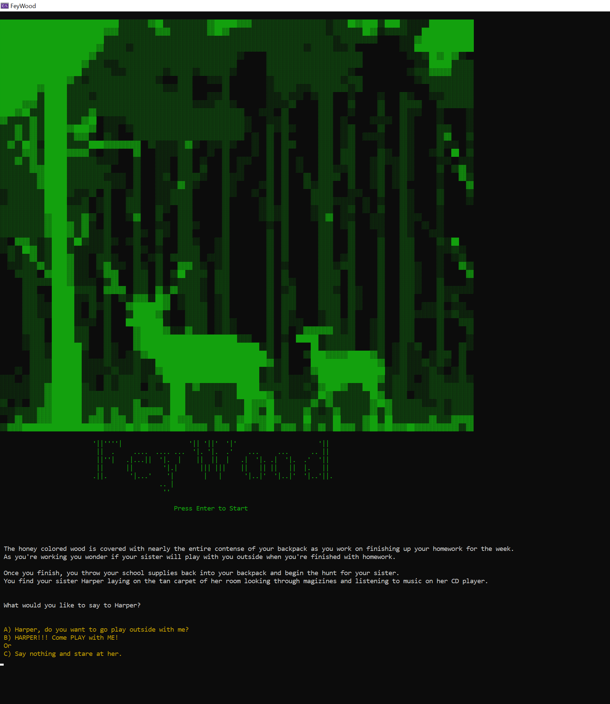
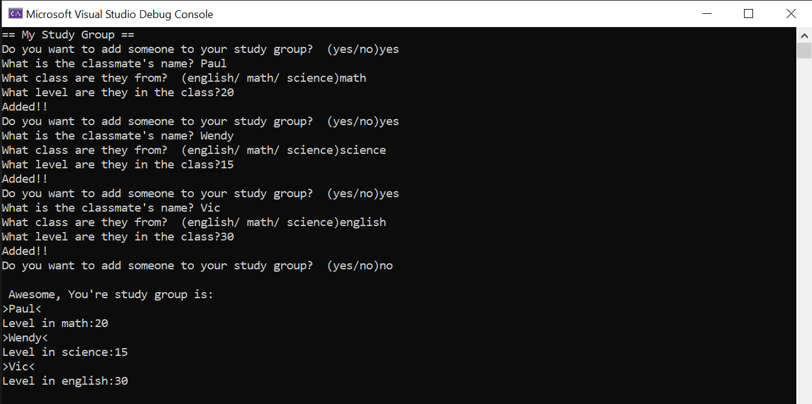
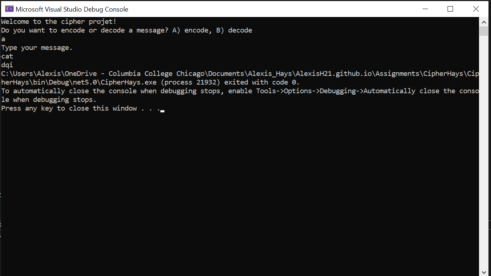
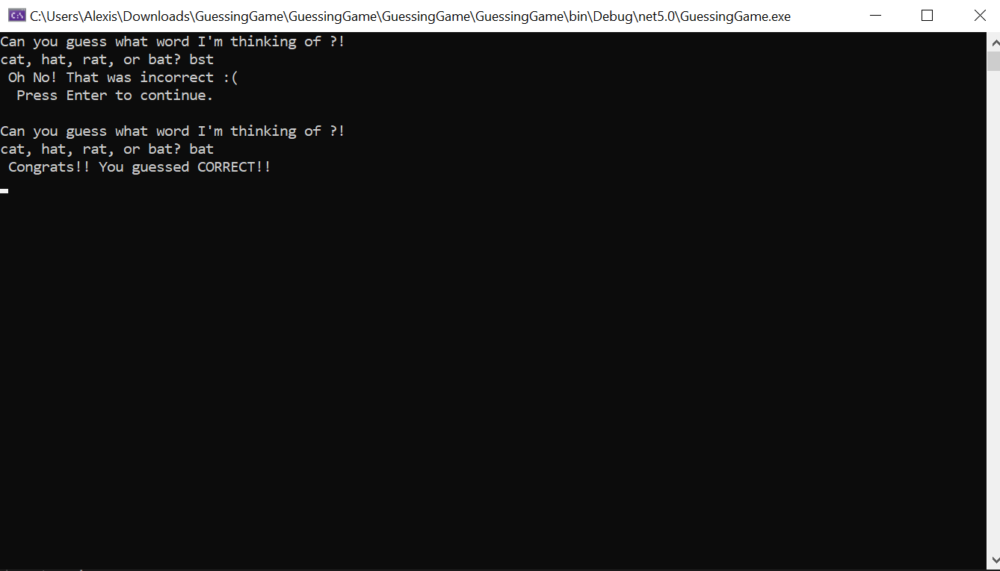
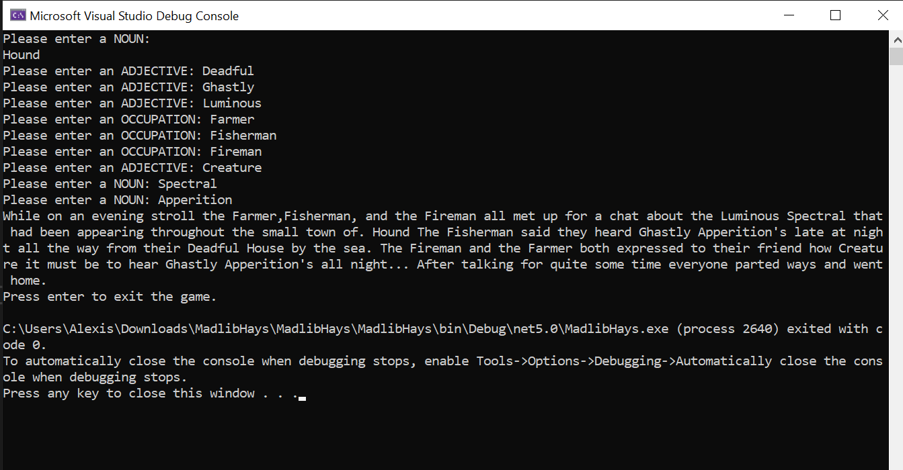

# Programming Portfolio
*Assignments*
## Adventer Game: Midterm
*FeyWood*

This was the text based game I made for my programming1 midterm assignment. It's inspired by fairy folklore.

# Study Application

This was an assignment on making an application involving lists and integers to track a players answer.

# Cipher 

This game is about encoding and decoding messages.

## Guessing Game

This game is about guessing what word the the console had picked. If you get it right you win!
## Madlib

This game is a madlib game where you type in words and get a funny story.
